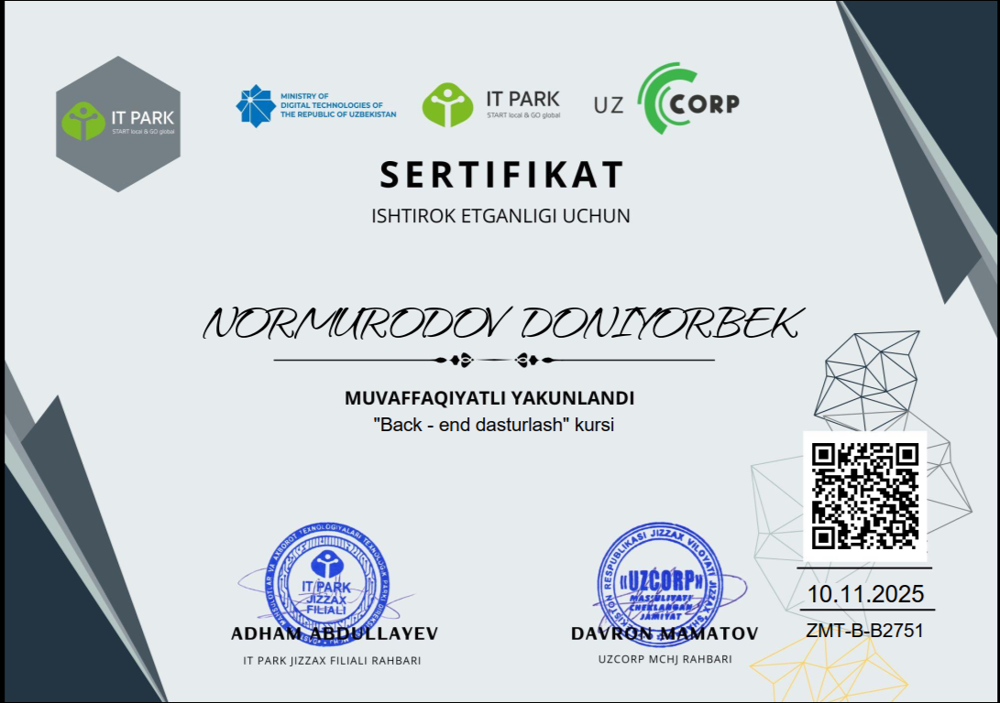
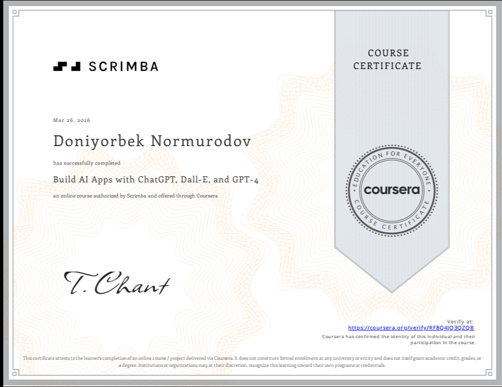
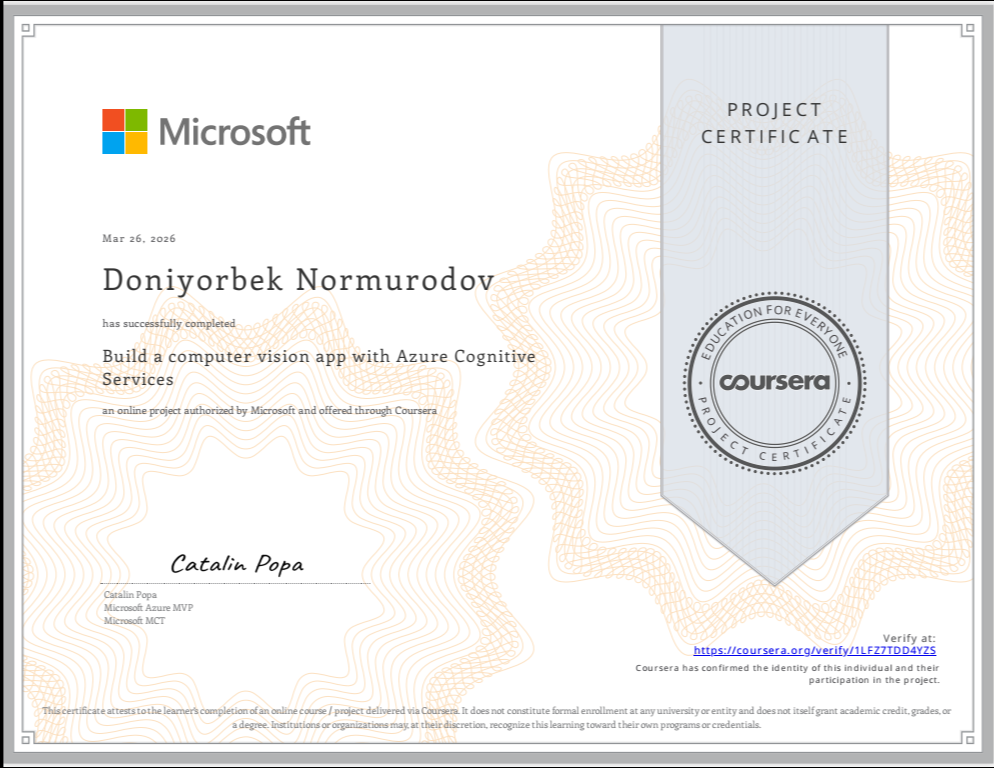
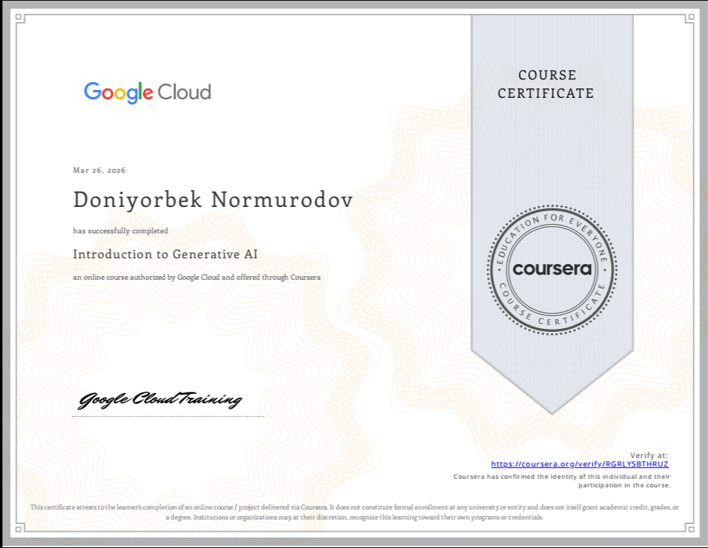
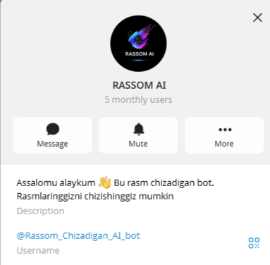
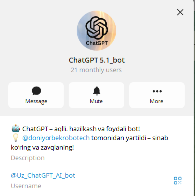
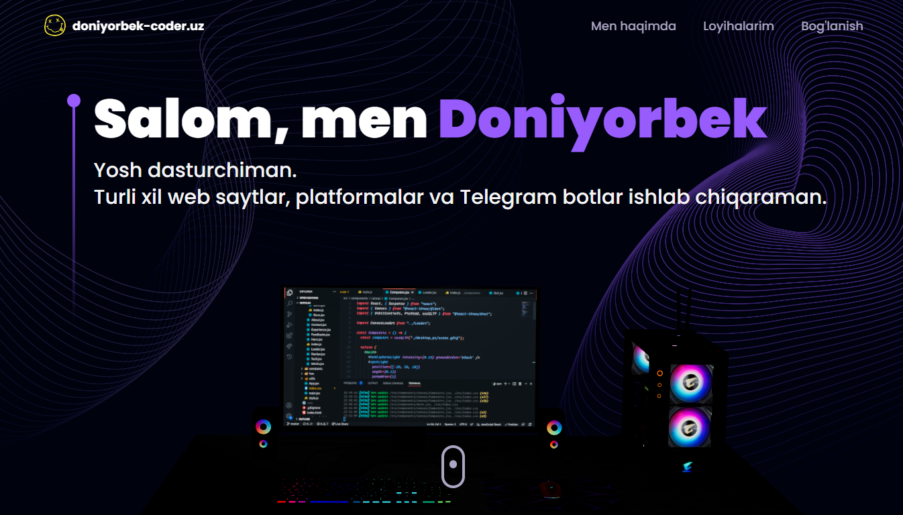
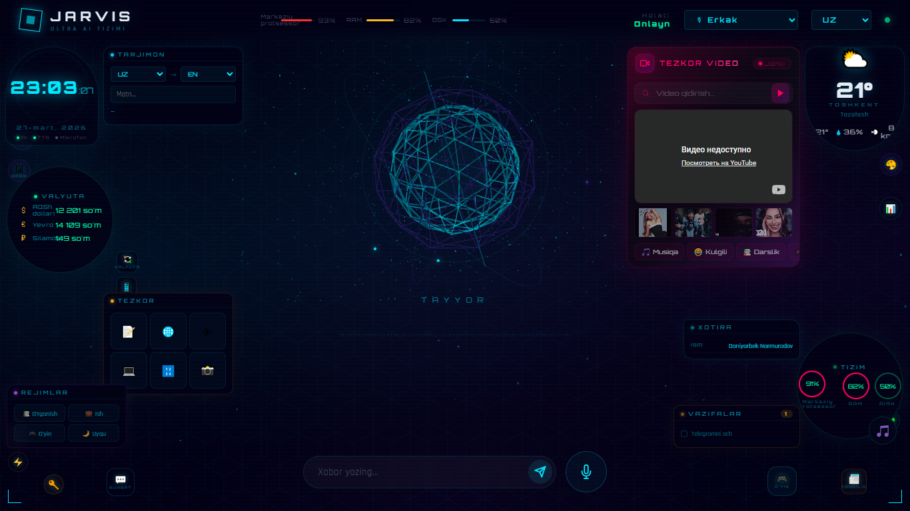

# 👋 Assalomu alaykum! Men Doniyorbek  

  

---

## 🚀 Men haqimda
💻 Men **Full-Stack va Backend dasturchiman**, zamonaviy web va AI texnologiyalarini birlashtiraman.  
🎯 Maqsadim — **foydalanuvchilar uchun qulay va innovatsion ilovalar yaratish**.  

- 🔧 **Backend:** Python, Django, FastAPI  
- 📱 **Frontend:** React, Tailwind CSS  
- ⚡ **Maxsus:** REST API, AI botlar, avtomatlashtirilgan tizimlar  
- 🧠 **Rivojlanish:** Doimiy o‘rganish va yangi texnologiyalarni sinab ko‘rish  
- 🏗️ **Tajriba:** 5+ real loyiha muvaffaqiyatli yakunlangan

---

## 🏆 Sertifikatlar

  

  
  

  
  

  🎓 <strong>Python Backend Development</strong> • Zomin IT Park  
   
  🚀 Boshqa IT sertifikatlar va kurslar

---
## 🛠 Texnologiyalar

  

---

## 🚀 Loyihalar

### 🤖 Rassom AI Bot

  

🔗 [Rassom AI Bot](https://t.me/Rassom_Chizadigan_AI_bot) — **AI yordamida rasmlar yaratadigan Telegram bot**

---

### 💬 ChatGPT Telegram Bot

  

🔗 [ChatGPT Telegram Bot](https://t.me/Uz_ChatGPT_AI_bot) — **AI yordamida interaktiv chat tajribasi**

---

### 🌐 Portfolio Web Site

  

🔗 [Portfolio](https://www.doniyorbek-coder.uz/) — **Shaxsiy web portfolio sayt**

---

### Jarvis AI Assistant

  

🔗 AI asosidagi **shaxsiy yordamchi** loyihasi  

---

## 📊 GitHub Statistikalar

  
   
  

---

## 🧠 Activity Graph

  

---

## ⚡ Motivatsiya
 <section class="max-w-4xl mx-auto py-8 px-4">
        <h2 class="text-2xl font-bold mb-4">💻 “Kod - bu fikringni dunyoga ko'rsatish usuli !”</h2>
        

            
            
        

    </section>
    

  💡 "Kod yozing, xatolarni qabul qiling, va har doim yangi narsalarni o‘rganing!" 🚀  
   
  🌟 "Innovatsiya — har bir kichik qadamda yashaydi."  
   
  🔥 "Fikrni amaliyotga aylantirish eng kuchli motivatsiya."  

  ---

## ✨ Shaxsiy maqsad va qiziqishlar
Yosh dasturchi, 15 yosh, Zomindanman. Web va robototexnikaga juda qiziqaman, shu sababli o‘z bilimlarimni doimiy ravishda kengaytiraman.

Maqsadim: Professional dasturchi bo‘lib, foydalanuvchilar uchun zamonaviy, interaktiv va qulay web-ilovalar yaratish.

🚀 Kelajakda Python va Full-Stack texnologiyalar yordamida innovatsion loyihalarni ishlab chiqish va AI/NLP texnologiyalarini real dunyo muammolariga tatbiq etish.

🔧 Qiziqishlarim va yo‘nalishlarim:

Web dasturlash: Frontend (React, Tailwind CSS) va Backend (Django, FastAPI)
AI/NLP loyihalari, chat va Telegram botlar
Robototexnika va avtomatlashtirilgan tizimlar
Zamonaviy web-loyihalarni yaratish va optimallashtirish.

---

<section class="max-w-4xl mx-auto py-8 px-4 bg-white shadow rounded-lg my-6">
        <h2 class="text-2xl font-bold mb-4">📬 Men bilan bog‘laning</h2>
        <ul class="list-disc list-inside space-y-2">
            <li>🌐 GitHub: <a href="https://github.com/Coder-Doniyorbek" class="text-blue-600 underline">Coder-Doniyorbek</a></li>
            <li>💬 Telegram: <a href="https://t.me/doniyorbek_coder" class="text-blue-600 underline">@doniyorbek_coder</a></li>
            <li>✉️ Email: coderdoniyorbek@gmail.com</li>
            <li>🌐 LinkedIn: <a href="https://www.linkedin.com/in/doniyorbek-normurodov-694a16376/" class="text-blue-600 underline">Doniyorbek</a></li>
            <li>🌐 Portfolio: <a href="https://github.com/Robotech203/portfolio-web" class="text-blue-600 underline">Portfolio Web App</a></li>
        </ul>
    </section>
     

  
  
  

---

  

